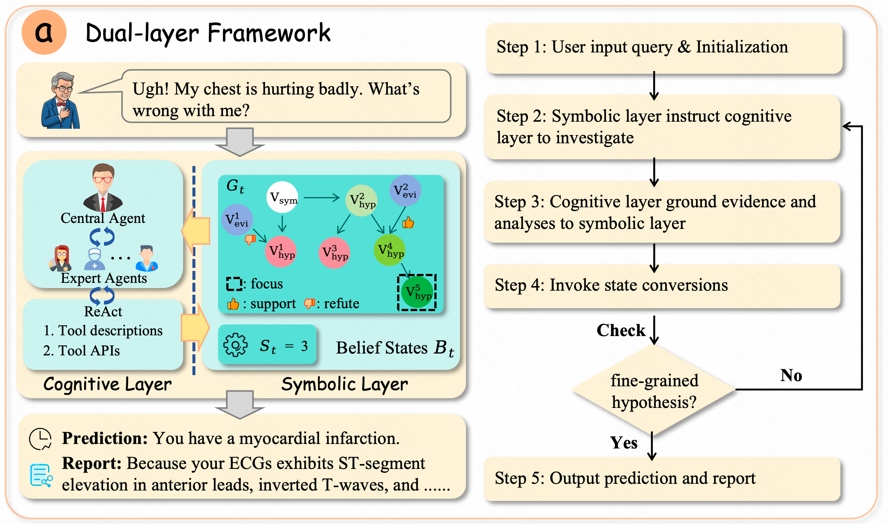

<!-- <div align="center">

 -->

# Graph of States: Solving Abductive Tasks with Large Language Models


[](https://arxiv.org/pdf/2603.21250)
[](https://opensource.org/licenses/MIT)
[](https://www.python.org/)


<div align="center">
  
</div>

</div>


## 📖 Abstract

Logical reasoning encompasses deduction, induction, and abduction. However, while Large Language Models (LLMs) have effectively mastered the former two, abductive reasoning remains significantly underexplored. Existing frameworks, predominantly designed for static deductive tasks, fail to generalize to abductive reasoning due to unstructured state representation and lack of explicit state control. Consequently, they are inevitably prone to Evidence Fabrication, Context Drift, Failed Backtracking, and Early Stopping. To bridge this gap, we introduce Graph of States (GoS), a general-purpose neuro-symbolic framework tailored for abductive tasks. GoS grounds multi-agent collaboration in a structured belief states, utilizing a causal graph to explicitly encode logical dependencies and a state machine to govern the valid transitions of the reasoning process. By dynamically aligning the reasoning focus with these symbolic constraints, our approach transforms aimless, unconstrained exploration into a convergent, directed search. Extensive evaluations on two real-world datasets demonstrate that GoS significantly outperforms all baselines, providing a robust solution for complex abductive tasks. Code repo and all prompts: https://github.com/gaorch85/Graph-of-States.


## 🔥 News
* **[2026-05-01]** 🎉 **Graph of States** has been accepted by ICML 2026!
* **[2026-01-22]** 🚀 **Graph of States** code released!

## 🌟 Key Features

GoS introduces a dual-layer neuro-symbolic architecture designed to solve complex abductive tasks in high-stakes domains like Medical Diagnosis and Failure Diagnosis in Distributed Systems.

* **🧠 Cognitive Layer :** A role-based collaborative framework orchestrating agents aligned with real-world professional roles (e.g., *Physician*, *LinuxOperator*) for domain-specific execution.
* **🕸️ Symbolic Layer :**
    * **Causal Graph ($G$):** Explicitly structures belief states by mapping causal relationships among hypotheses and evidence, mitigating *Evidence Fabrication* and *Context Drift*.
    * **State Machine ($S$):** Governs the reasoning trajectory, enforcing rigorous logical transitions (Backtracking & Drill-down) to prevent *Failed Backtracking* and *Early Stopping*.
* **🎯 Directed Search guided by reasoning focus ($h_t^*$):** Transforms aimless stochastic exploration into a convergent search by dynamically aligning reasoning focus with symbolic constraints.

> Check the `assets` folder to see the comic version of GoS.

## 🖼️ Methodology

<div align="center">
  
  <br>
  <em>Overview of the GoS Dual-Layer Neuro-Symbolic Framework.</em>
</div>


## 🛠️ Installation

1.  **Clone the repository**

    Download the zip file of this repo to your server and unzip it.
    ```bash
    cd Gos
    ```

2.  **Create a virtual environment (Recommended)**
    ```bash
    conda create -n Gos python=3.12.11
    conda activate Gos
    ```

3.  **Install dependencies**
    ```bash
    pip install -r requirements.txt
    ```

4.  **Configure API Keys**
    ```bash
    OPENAI_API_KEY="Your-API-KEY"
    ```

## 🚀 Quick Start

Graph of States supports multiple domains. Below are examples for running the framework on Medical Diagnosis.

Note: You can change the configs in ``/gos/configs``

### Medical Diagnosis (DiagnosisArena)
Run the diagnosis on a sample case:

```bash
python main.py 
```


## 📂 Project Structure

```text
GoS/
├── assets/              # Images and figures
├── agents/              # Definition of central agent and expert agents
├── belief/              # Definition of causal graph and state machine
├── configs/             # configs of the agents, belief and domain
├── prompts/             # All the prompt used
├── Run/                 # Load the data from different domains
├── utils/               # Tools and public functions
├── evaluate_IT.py       # Evaluation of the "Failure Diagnosis in Distributed System" domain
├── evaluate_Medical.py  # Evaluation of the "Medical Diagnosis" domain
├── main.py              # The entrance of the experiments
└── requirements.txt     # Dependencies
```

